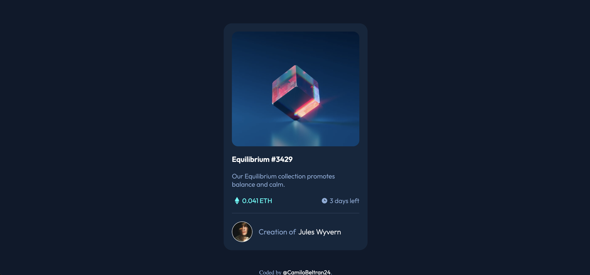

## Welcome! 👋
# Frontend Mentor - NFT preview card component solution

This is a solution to the [NFT preview card component challenge on Frontend Mentor](https://www.frontendmentor.io/challenges/nft-preview-card-component-SbdUL_w0U). Frontend Mentor challenges help you improve your coding skills by building realistic projects. 

## Table of contents

- [Overview](#overview)
  - [The challenge](#the-challenge)
  - [Screenshot](#screenshot)
  - [Links](#links)
- [My process](#my-process)
  - [Built with](#built-with)
- [Author](#author)
## Overview

### The challenge

Users should be able to:

- View the optimal layout depending on their device's screen size
- See hover states for interactive elements

### Screenshot

### Links
- GitHub Repo: [To Repository](https://github.com/CamiloBeltran24/nft-preview-card-component)
- Solution URL: [To Solution](https://www.frontendmentor.io/solutions/nft-preview-card-component-0ufvJbLw1)
- Live Site URL: [To Live Site](https://camilobeltran24.github.io/nft-preview-card-component/)

## My process

### Built with

- Semantic HTML5 markup
- CSS custom properties
- Flexbox
- Mobile-first workflow

## Author

- GitHub - [@CamiloBeltran24](https://github.com/CamiloBeltran24)
- Frontend Mentor - [@CamiloBeltran24](https://www.frontendmentor.io/profile/CamiloBeltran24)
- Twitter - [@CamiloBeltran](https://www.twitter.com/CamiloBeltran)
